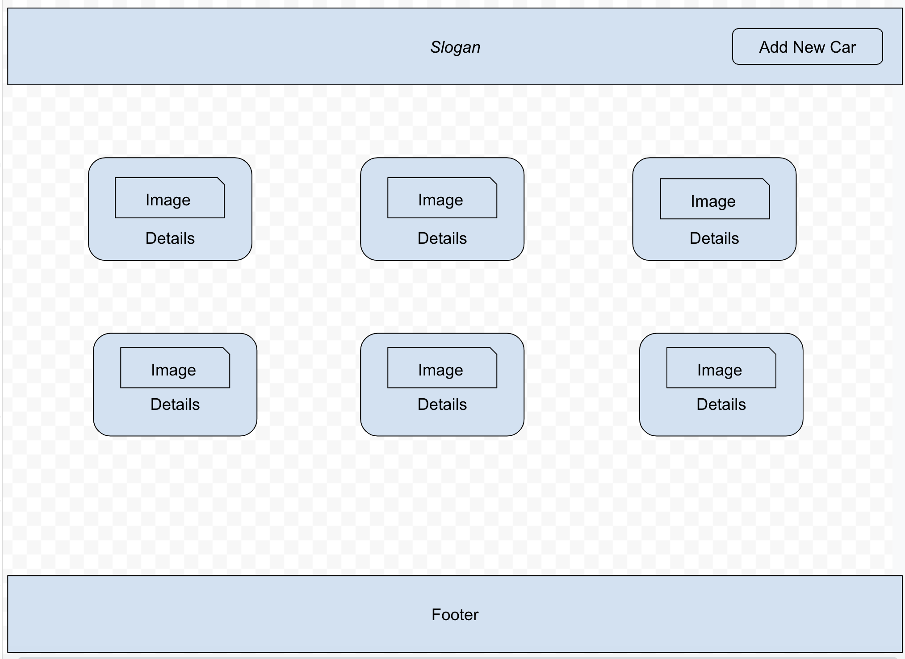
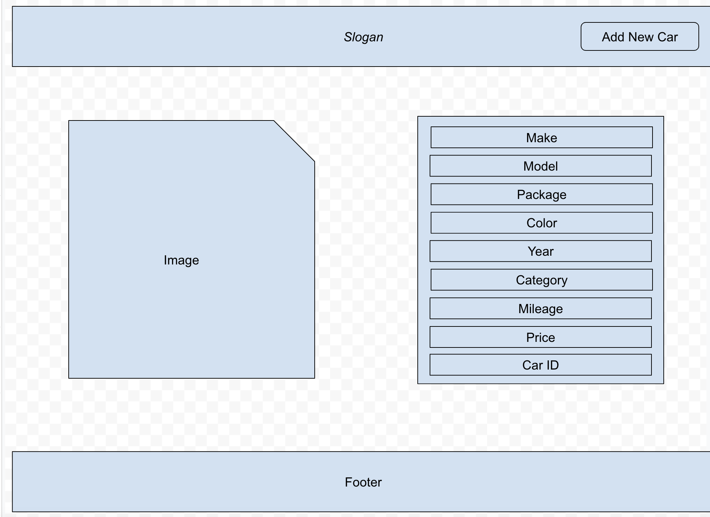
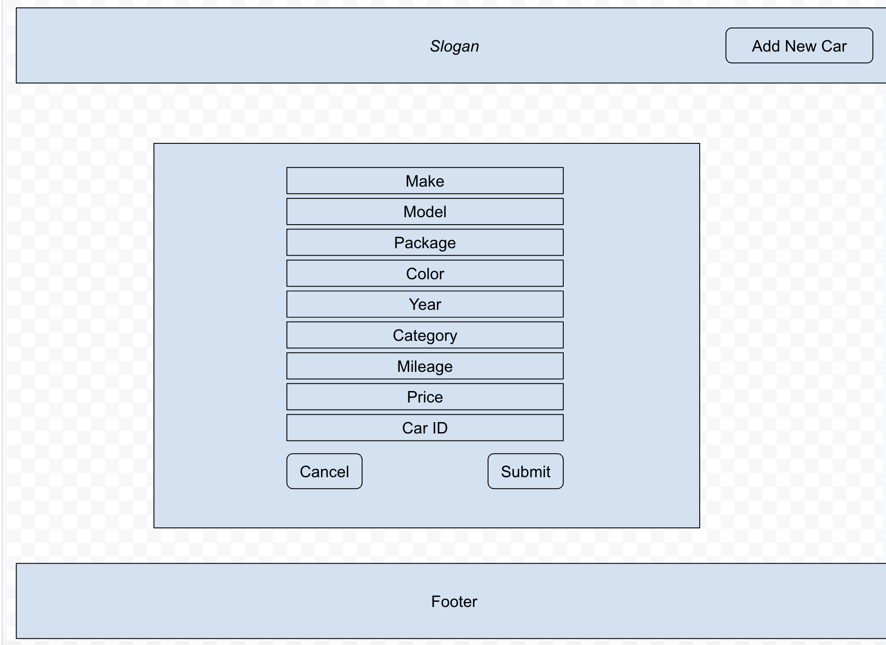

# Cars

Cars is a full CRUD Web application that stores and handles details of cars using React, Express and MongoDB.

---

## Screenshots

### Home Screen

### Detail Screen

### Create Screen

---

## User Stories

### As a user, I want to:
* see cars displayed on a home page.
* click on an item and view information about that item.
* add new car details.
* see created car details on the home page.

---

## Routes

| Name | Path | HTTP Verb | Purpose |
|--------|-----|--------|-----|
| Home | /cars | GET | Show all cars
| Detail | /cars/:id | GET | Show car details
| Create | /cars | POST | Create new car details
| Edit | /cars/:id | PUT | Update car details
| Delete | /cars/:id | DELETE | Delete car details

## Technologies Used

### Backend

MongoDB
express
mongoose
dotenv
morgan
node
Heroku

### Frontend

ReactJS
JaveScript
HTML5
React Icons
CSS
Bootstrap
Netlify

---

## Getting Started

[Click Here](https://github.com/madhu-mida/cars-apex) to see Backend Repo.

[Click Here](https://ms-95-cars-backend-apex.herokuapp.com/cars/) to see deployed Heroku app.

[Click Here](https://magical-valkyrie-0976d2.netlify.app/) to see deployed Netlify app.

---

## Future Enhancements

Add search, authentication, authorization features.
